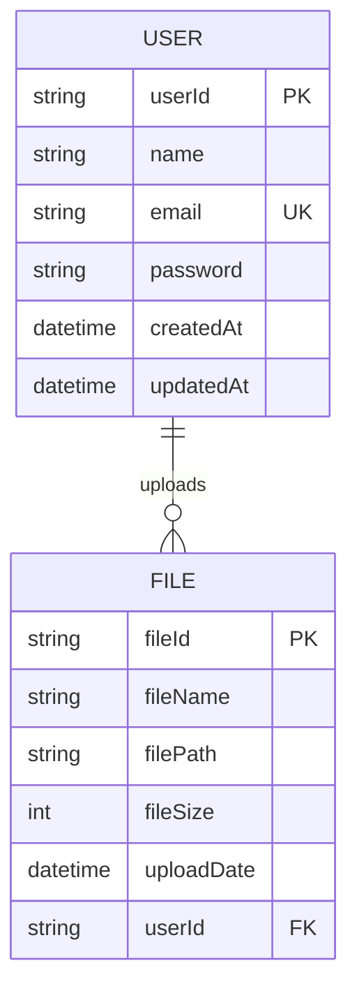

# ER Diagram

```mermaid
erDiagram
    USER {
        string userId PK
        string name
        string email UK
        string password
        datetime createdAt
        datetime updatedAt
    }

    FILE {
        string fileId PK
        string fileName
        string filePath
        int fileSize
        datetime uploadDate
        string userId FK
    }

    USER ||--o{ FILE : "uploads"
```
