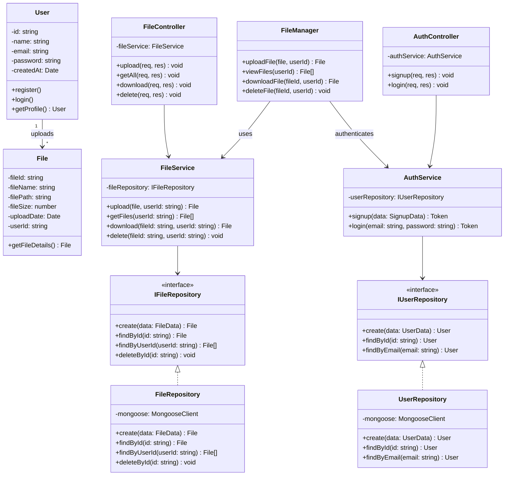

# Class Diagram

```mermaid
classDiagram
    class User {
        -id: string
        -name: string
        -email: string
        -password: string
        -createdAt: Date
        +register()
        +login()
        +getProfile() User
    }

    class File {
        -fileId: string
        -fileName: string
        -filePath: string
        -fileSize: number
        -uploadDate: Date
        -userId: string
        +getFileDetails() File
    }

    class FileManager {
        +uploadFile(file, userId) File
        +viewFiles(userId) File[]
        +downloadFile(fileId, userId) File
        +deleteFile(fileId, userId) void
    }

    class IUserRepository {
        <<interface>>
        +create(data: UserData) User
        +findById(id: string) User
        +findByEmail(email: string) User
    }

    class IFileRepository {
        <<interface>>
        +create(data: FileData) File
        +findById(id: string) File
        +findByUserId(userId: string) File[]
        +deleteById(id: string) void
    }

    class UserRepository {
        -mongoose: MongooseClient
        +create(data: UserData) User
        +findById(id: string) User
        +findByEmail(email: string) User
    }

    class FileRepository {
        -mongoose: MongooseClient
        +create(data: FileData) File
        +findById(id: string) File
        +findByUserId(userId: string) File[]
        +deleteById(id: string) void
    }

    class AuthService {
        -userRepository: IUserRepository
        +signup(data: SignupData) Token
        +login(email: string, password: string) Token
    }

    class FileService {
        -fileRepository: IFileRepository
        +upload(file, userId: string) File
        +getFiles(userId: string) File[]
        +download(fileId: string, userId: string) File
        +delete(fileId: string, userId: string) void
    }

    class AuthController {
        -authService: AuthService
        +signup(req, res) void
        +login(req, res) void
    }

    class FileController {
        -fileService: FileService
        +upload(req, res) void
        +getAll(req, res) void
        +download(req, res) void
        +delete(req, res) void
    }

    IUserRepository <|.. UserRepository
    IFileRepository <|.. FileRepository

    AuthService --> IUserRepository
    FileService --> IFileRepository

    AuthController --> AuthService
    FileController --> FileService

    FileManager --> FileService : uses
    FileManager --> AuthService : authenticates

    User "1" --> "*" File : uploads
```
