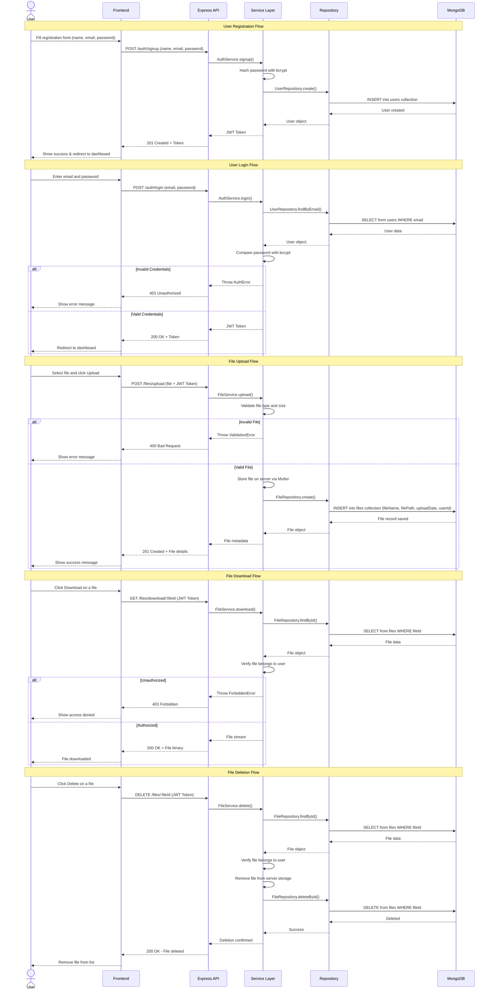

# Sequence Diagram

```mermaid
sequenceDiagram
    actor U as User
    participant FE as Frontend
    participant API as Express API
    participant Svc as Service Layer
    participant Repo as Repository
    participant DB as MongoDB

    Note over U, DB: User Registration Flow

    U->>FE: Fill registration form (name, email, password)
    FE->>API: POST /auth/signup (name, email, password)
    API->>Svc: AuthService.signup()
    Svc->>Svc: Hash password with bcrypt
    Svc->>Repo: UserRepository.create()
    Repo->>DB: INSERT into users collection
    DB-->>Repo: User created
    Repo-->>Svc: User object
    Svc-->>API: JWT Token
    API-->>FE: 201 Created + Token
    FE-->>U: Show success & redirect to dashboard

    Note over U, DB: User Login Flow

    U->>FE: Enter email and password
    FE->>API: POST /auth/login (email, password)
    API->>Svc: AuthService.login()
    Svc->>Repo: UserRepository.findByEmail()
    Repo->>DB: SELECT from users WHERE email
    DB-->>Repo: User data
    Repo-->>Svc: User object
    Svc->>Svc: Compare password with bcrypt
    alt Invalid Credentials
        Svc-->>API: Throw AuthError
        API-->>FE: 401 Unauthorized
        FE-->>U: Show error message
    else Valid Credentials
        Svc-->>API: JWT Token
        API-->>FE: 200 OK + Token
        FE-->>U: Redirect to dashboard
    end

    Note over U, DB: File Upload Flow

    U->>FE: Select file and click Upload
    FE->>API: POST /files/upload (file + JWT Token)
    API->>Svc: FileService.upload()
    Svc->>Svc: Validate file type and size
    alt Invalid File
        Svc-->>API: Throw ValidationError
        API-->>FE: 400 Bad Request
        FE-->>U: Show error message
    else Valid File
        Svc->>Svc: Store file on server via Multer
        Svc->>Repo: FileRepository.create()
        Repo->>DB: INSERT into files collection (fileName, filePath, uploadDate, userId)
        DB-->>Repo: File record saved
        Repo-->>Svc: File object
        Svc-->>API: File metadata
        API-->>FE: 201 Created + File details
        FE-->>U: Show success message
    end

    Note over U, DB: File Download Flow

    U->>FE: Click Download on a file
    FE->>API: GET /files/download/:fileId (JWT Token)
    API->>Svc: FileService.download()
    Svc->>Repo: FileRepository.findById()
    Repo->>DB: SELECT from files WHERE fileId
    DB-->>Repo: File data
    Repo-->>Svc: File object
    Svc->>Svc: Verify file belongs to user
    alt Unauthorized
        Svc-->>API: Throw ForbiddenError
        API-->>FE: 403 Forbidden
        FE-->>U: Show access denied
    else Authorized
        Svc-->>API: File stream
        API-->>FE: 200 OK + File binary
        FE-->>U: File downloaded
    end

    Note over U, DB: File Deletion Flow

    U->>FE: Click Delete on a file
    FE->>API: DELETE /files/:fileId (JWT Token)
    API->>Svc: FileService.delete()
    Svc->>Repo: FileRepository.findById()
    Repo->>DB: SELECT from files WHERE fileId
    DB-->>Repo: File data
    Repo-->>Svc: File object
    Svc->>Svc: Verify file belongs to user
    Svc->>Svc: Remove file from server storage
    Svc->>Repo: FileRepository.deleteById()
    Repo->>DB: DELETE from files WHERE fileId
    DB-->>Repo: Deleted
    Repo-->>Svc: Success
    Svc-->>API: Deletion confirmed
    API-->>FE: 200 OK - File deleted
    FE-->>U: Remove file from list
```
