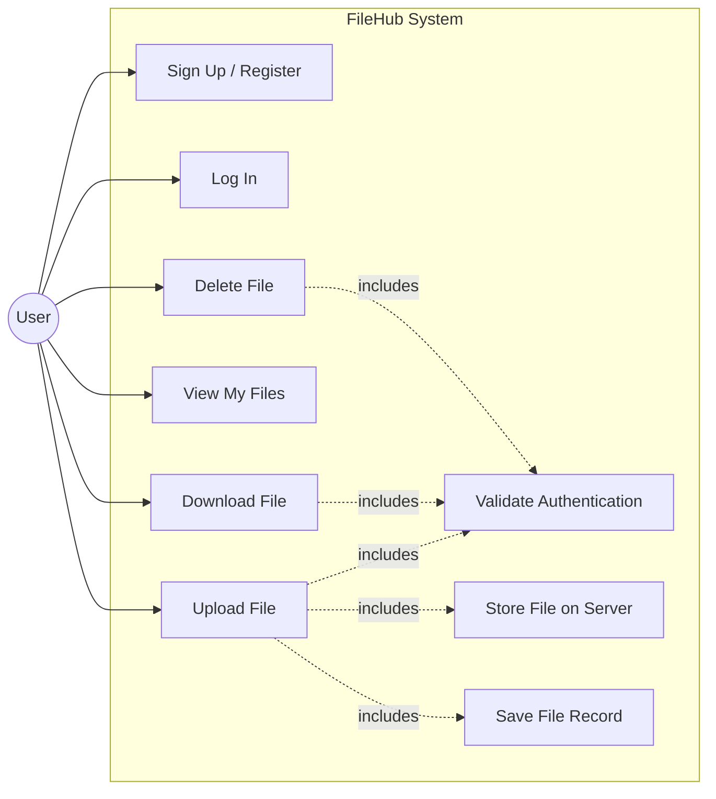

# Use Case Diagram

```mermaid
flowchart LR
    User(("User"))

    subgraph FileHub System
        UC1["Sign Up / Register"]
        UC2["Log In"]
        UC3["Upload File"]
        UC4["View My Files"]
        UC5["Download File"]
        UC6["Delete File"]
        UC7["Validate Authentication"]
        UC8["Store File on Server"]
        UC9["Save File Record"]
    end

    User --> UC1
    User --> UC2
    User --> UC3
    User --> UC4
    User --> UC5
    User --> UC6

    UC3 -.->|"includes"| UC7
    UC3 -.->|"includes"| UC8
    UC3 -.->|"includes"| UC9
    UC5 -.->|"includes"| UC7
    UC6 -.->|"includes"| UC7
```
